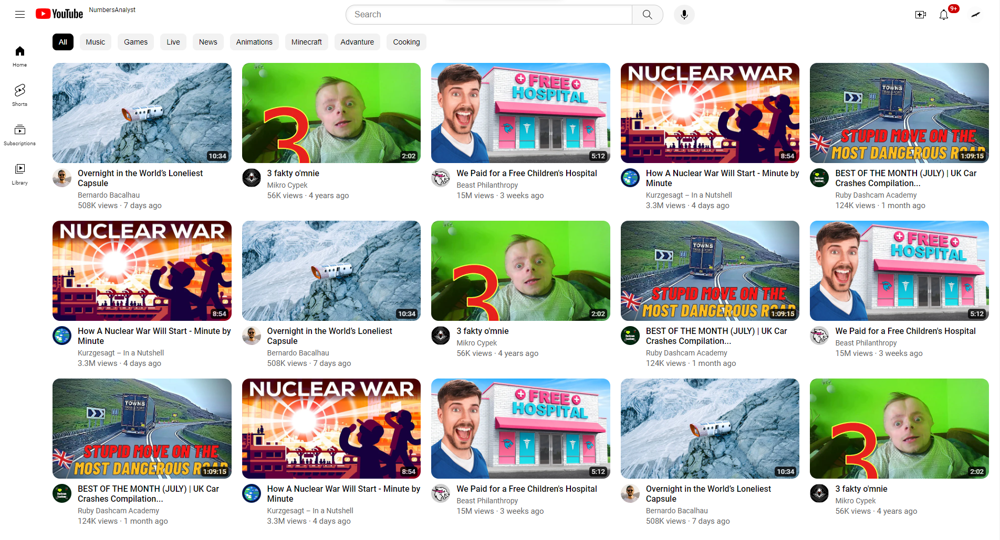

# Youtube fresh copy
My own copy of YouTube 2023 page made with HTML and CSS. It's my update to my old repository called [youtube-course](https://github.com/numbersanalyst/youtube-course).

## That's how main page looks

## Important note
It's a very faitlhul copy of YouTube. Only what's I missed is Shorts slider in home page. I don't do that because it's imposible to change the position of the slider when the video grid changes layout. Dynamic positioning is required in that case. So maybe with JS it's possible to do it. But never mind.

## Small, big details
* tooltips for the channels, under videos
* tooltips for the icons in header section
* reactions to hover, and active state of the buttons

> Photos and many icons are from Google ©2023
